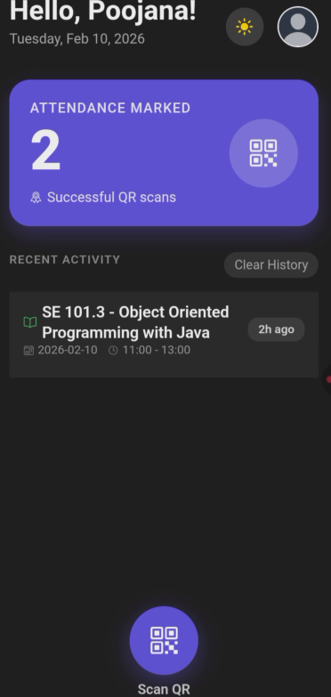
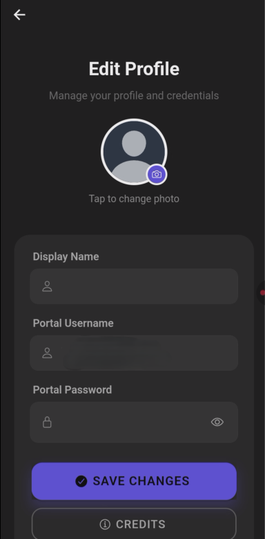
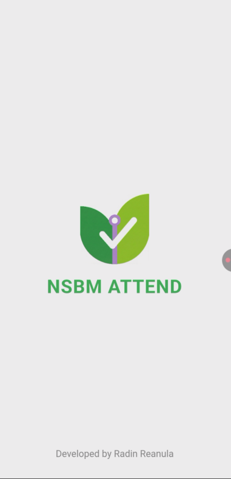
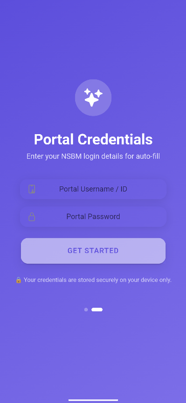
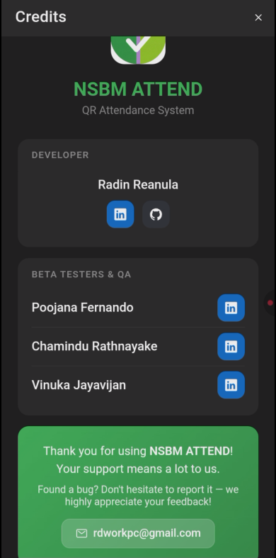
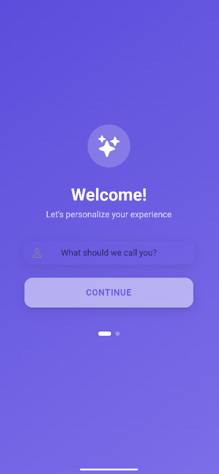

<div align="center">


# 📱 NSBM ATTEND

### Smart QR Attendance for NSBM Green University

[](https://www.android.com/)
[](https://ionicframework.com/)
[](https://www.typescriptlang.org/)
[](https://capacitorjs.com/)
[](LICENSE)

**NSBM ATTEND** is a mobile application that simplifies lecture attendance marking at NSBM Green University. Scan the QR code, and the app does the rest — auto-login, attendance marking, and lecture detail extraction, all in a single tap.

[Download APK](#-download) • [Features](#-features) • [How It Works](#-how-it-works) • [Tech Stack](#-tech-stack)

</div>

---

<div align="center">

## 📸 Screenshots

| Home Dashboard | QR Scanner | Settings |
|:-:|:-:|:-:|
|  |  |  |

| Onboarding | Welcome | Credits |
|:-:|:-:|:-:|
|  |  |  |

| Welcome |
|:-:|
|  |

</div>

---

## ✨ Features

### 🔍 Smart QR Scanning
- Real-time camera QR scanning powered by **Google ML Kit**
- Flashlight toggle for low-light environments
- Pinch-to-zoom functionality for distant QR codes
- Instant scan feedback with haptic response

### 🔐 One-Tap Auto Login
- Save your NSBM credentials securely on your device
- Auto-fills username & password on the university portal
- Seamless login → attendance marking flow — no manual typing needed

### 📋 Lecture Detail Extraction
- Automatically extracts lecture information after attendance is marked
- Displays **Module Name**, **Date**, and **Time** in Recent Activity
- Replaces raw URLs with readable lecture cards

### 🛡️ University Domain Lock
- Only accepts QR codes from the official `nsbm.ac.lk` domain
- Blocks non-university and malicious QR codes with a warning alert
- Protects against phishing and unauthorized URL redirection

### 🌓 Dark & Light Mode
- Beautiful theme toggle with smooth transitions
- Respects system-level dark mode preference on first launch
- Persistent theme preference across sessions

### 👤 User Profiles
- Customizable display name and profile photo
- Camera or gallery photo selection
- Personalized greeting on the home dashboard

### 📊 Attendance Tracking
- Running count of total successful QR attendance scans
- Recent Activity feed with the last 5 scans
- Swipe-to-delete individual scan records
- Clear all history option

### 🚀 First-Time User Onboarding
- Guided setup wizard for new users
- Step-by-step credential and profile configuration
- Skip option for returning users

---

## 🔄 How It Works

```
┌─────────────────────────────────────────────────────────┐
│                                                         │
│   📷 Scan QR Code                                       │
│       │                                                 │
│       ▼                                                 │
│   🔒 Domain Check (nsbm.ac.lk?)                         │
│       │                                                 │
│       ├── ❌ Non-NSBM → Alert & Block                    │
│       │                                                 │
│       └── ✅ Valid → Open University Portal               │
│               │                                         │
│               ▼                                         │
│           🔑 Auto-fill Credentials                       │
│               │                                         │
│               ▼                                         │
│           ✅ Attendance Marked                            │
│               │                                         │
│               ▼                                         │
│           📋 Extract Lecture Details                      │
│           (Module, Date, Time)                          │
│               │                                         │
│               ▼                                         │
│           💾 Save to Recent Activity                     │
│                                                         │
└─────────────────────────────────────────────────────────┘
```

---

## 🛠️ Tech Stack

<div align="center">

| Category | Technology | Purpose |
|:--------:|:----------:|:-------:|
| **Framework** |  | Cross-platform UI framework |
| **Frontend** |  | Component-based UI library |
| **Language** |  | Type-safe JavaScript |
| **Build Tool** |  | Fast build & HMR |
| **Native Runtime** |  | Native bridge & plugins |
| **QR Scanner** |  | Barcode detection |
| **Browser** |  | In-app web views |
| **Storage** |  | Local data persistence |
| **Platform** |  | Target platform |

</div>

### Architecture Overview

```
┌──────────────────────────────────────────────────────┐
│                    NSBM ATTEND                       │
├──────────────────────────────────────────────────────┤
│                                                      │
│  ┌─────────────┐  ┌─────────────┐  ┌──────────────┐ │
│  │   Home      │  │  Settings   │  │  Components  │ │
│  │  Dashboard  │  │   Page      │  │  (Modals)    │ │
│  │  + Scanner  │  │  + Profile  │  │  + Onboard   │ │
│  │  + History  │  │  + Creds    │  │  + Credits   │ │
│  │  + Theme    │  │  + Password │  │  + Splash    │ │
│  └──────┬──────┘  └──────┬──────┘  └──────┬───────┘ │
│         │                │                │          │
│  ┌──────┴────────────────┴────────────────┴───────┐  │
│  │              Storage Service                   │  │
│  │   Credentials │ Profile │ Theme │ Scan History │  │
│  └────────────────────────┬───────────────────────┘  │
│                           │                          │
├───────────────────────────┼──────────────────────────┤
│                    Native Layer                      │
│  ┌──────────┐ ┌──────────┐ ┌────────┐ ┌──────────┐  │
│  │ ML Kit   │ │ InApp    │ │Camera  │ │Preferences│ │
│  │ Scanner  │ │ Browser  │ │Plugin  │ │  API     │  │
│  └──────────┘ └──────────┘ └────────┘ └──────────┘  │
└──────────────────────────────────────────────────────┘
```

---

## 🔒 Security

| Security Aspect | Details |
|----------------|---------|
| **Credential Storage** | Stored locally on-device via Android SharedPreferences (per-app sandbox) |
| **No Cloud Storage** | Credentials never leave the device — no server-side storage |
| **APK Safety** | Credentials are NOT bundled in APK — each device has isolated storage |
| **Domain Validation** | Only `nsbm.ac.lk` URLs are processed — all other domains are blocked |
| **Session Handling** | University portal manages sessions via server-side PHP cookies |

---

## 📥 Download

<!-- Add your APK download link here -->
> **Latest Release**: Check the [Releases](https://github.com/RadinReanula/NSBM-Attend/releases) section for the latest signed APK.

### Installation

1. Download the `.apk` file from [Releases](https://github.com/RadinReanula/NSBM-Attend/releases)
2. Enable **Install from Unknown Sources** on your Android device
3. Open the downloaded file and tap **Install**
4. Launch **NSBM ATTEND** and follow the onboarding setup

### Requirements

- Android 7.0 (API 24) or higher
- Camera access for QR scanning
- Active internet connection for university portal access

---

## 📁 Project Structure

```
NSBM ATTEND
├── src/
│   ├── components/
│   │   ├── CreditsModal         # App credits & team info
│   │   ├── OnboardingModal      # First-time user setup wizard
│   │   └── SplashOverlay        # Branded splash screen
│   ├── pages/
│   │   ├── Home                 # Dashboard, scanner, & history
│   │   └── Settings             # Profile & credentials management
│   ├── services/
│   │   └── storage.ts           # Local storage operations
│   ├── theme/                   # Ionic CSS variables
│   └── App.tsx                  # Root component & routing
├── android/                     # Native Android project
└── capacitor.config.ts          # Capacitor configuration
```

---

## 👨‍💻 Developer

<div align="center">

**Radin Reanula**

[](https://www.linkedin.com/in/radinreanula/)
[](https://github.com/RadinReanula)

</div>

### Beta Testers & QA

- **Poojana Fernando** — [LinkedIn](https://www.linkedin.com/in/poojana-fernando/)
- **Chamindu Rathnayake** — [LinkedIn](https://www.linkedin.com/in/chamidu-rathnayake-0b89702b8/)
- **Vinuka Jayavihan** — [LinkedIn](https://www.linkedin.com/in/vinuka-jayavijan-b8b49833a/)

---

## 📄 License

This project is licensed under the **MIT License** — see the [LICENSE](LICENSE) file for details.

---

<div align="center">

**Made with ❤️ for NSBM Green University**

*⚠️ This repository contains the showcase documentation only. Source code is private.*

</div>
